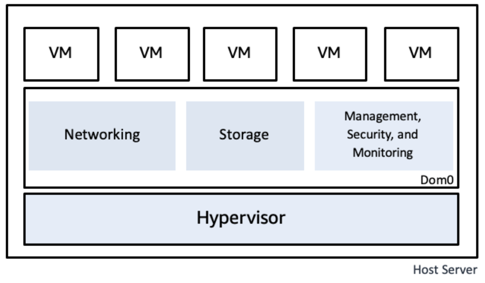
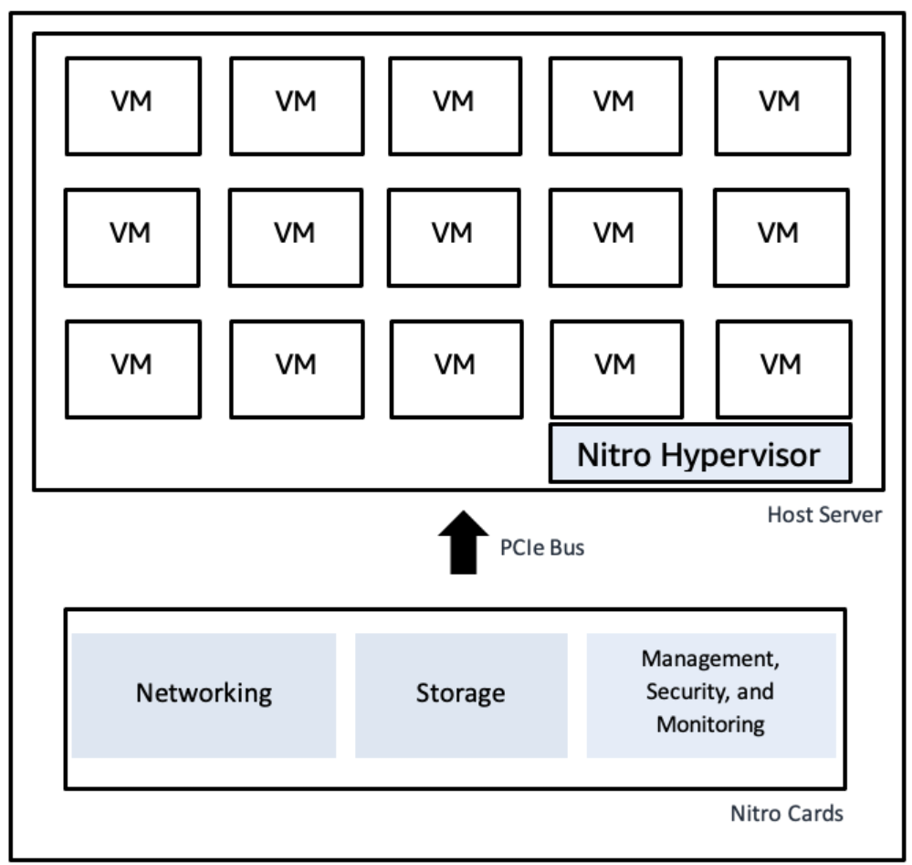

# Overview

EC2 is a web service providing scalable compute in the cloud. AWS Nitro is the underlying platform for all EC2 instances.

The AWS Nitro system is a combo of purpose built server-designs, data processors, system maanagement components, and specialized firmware which provide the underlying platform for all Amazon EC2 instances. Launched in beginning of 2018.

# Core Components

Purpose-Built Nitro Cards: 
    - Hardware designed by AWS for system control
    - I/O virtualization of the main system board with its CPUs and memory.
Nitro Security Chip: 
    - Secure boot process.
    - Ability to host bare metal instances
    - Prevents system firmware modification
Nitro Hypervisor: 
    - Firmware-like hypervisor
    - Provies resource isolation
    - Prevents admin access to na EC2 server

# Intro to Virtualization

Virtualization allows a single pc to run multiple operating systems at once. Host implements translation, emulation, restriction to provide multiple virtual machines (VM).

A virtual machine monitor (VMM) / Hypervisor manages each VM. Guests run most compute on CPU without VMM involvement. The VMM handles control of privileged instructions such as CPU control register read/write.

Device Models virtualize physical I/O hardware like network interfaces, storage devices, etc.

The hypervior runs a special VM called the system root, or dom0 or domain 0.

# Nitro journey

The Nitro System is a complete overhaul of virtualization for EC2. The system has eliminated the need for Dom0 on an EC2 instance, and a custom minimized hypervisor based on KVM provides a VMM and offloads Dom0 Functions to discrete Nitro Cards.

## Nitro components

- Purpose built Nitro Cards
    * Multiple Nitro Cards in a Nitro Server
        * Share power and PCIe interface with host Nitro Controller
    * Implement I/O
    * Connect to external EBS, storage, memory
- Nitro security Chip
- Nitro Hypervisor
- Nitro Controller
    * Responsible for managing all other components of the server system, including firmware loaded onto the other componenets of the system.
    * Firmware is stored on an SSD attached to nitro controller.
    * Encryption key for SSD protected by TPM
    * Performs secure bootup checking if changes have occured to system.

AWS owns the hardware and firmware of the cards. Hardware is designed by Annapurna Labs. Firmware is designed by dedicated AWS engineering teams.

### EC2 Control Plane
Nitro Controller, EC2 Servers, and network.
- Nitro controller is exclusive gateway between physical server and EC2 control plane, EBS, and VPC.

### Specialized Nitro Cards
- Nitro VPC card
- Nitro EBS card
- Nitro local NVMe Storage

## Nitro Security Chip

Intercepts and moderates all operations to local firmware at runtime.

## Nitro Hypervisor

Purpose built component. Does not have a shell or any general operating-system components. Super simple and can only perform purpose-built tasks.
- Immune to remote networking attacks.
- Can update live without taking down EC2 instances.

## No AWS Operator Access

No method for operators to access hypervisor or EC2 instances

## Passive communication design

Hypervisor cannot initiate outbound communication. Only waits for commands from the nitro controller across PCIe.

passive communication model ensures isolation and safety

## Side-Channel Defense

Customers never share L1/L2 cache or threads running on the same CPU complex, preventing side-channel attacks.

## Enclaves

Allows customers to divide their workloads into seperate components that need not trust each other.

## Security Summary

- **Infrastructure Security:** Hardware, Software, Networking and facilities are custom built for cloud security
- **Physical Access:** perimter and building entry points controlled
- **Media Sanitization:** Physical media is sanitized upon end of useful life.
- **Data Protection:** Encryption at physical layer