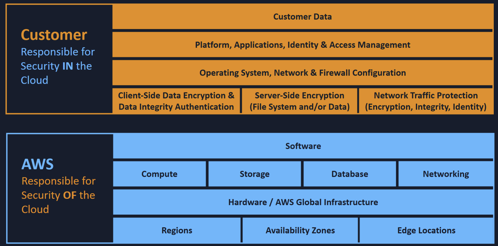

# Overview

## Brief history of AWS

SQS: 2004
    - Launched in 2004
    - Allowed published/consumer architecture
2006: EC2 and S3
    - Launched in 2006
    - AWS launched focused on startups
    - Dropbox, Airbnb, etc.
2010: Amazon moved to AWS
2012: First re:invent conference
2013: Certs Launched
2015: 6 Billion Revenue
2016: Run rate of 13 Billion
2017: AI services
2019: ML certs launched
2020: Run rate of 40 Billion
2023: 90 billion
2025: 123 Billion

## Building Blocks

## Benefits

- Pay for what you use
    * Timesharing and distributed systems

## Characteristics

- On-demand and self-service
    * Immediate access
- Easy access (only need internet)
- Resource Pooling
    * Use resources for a time, then return for others to use
- Rapid Elasticity
    * Scale up and down as needed
- Metered Services
    * Only pay for what you use

## Infrastructure

- Availability Zone: A single data center (or multiple data centers within miles of each other)
- Region: Multiple availability zones can form a region
- Edge location (cloudfront): Endpoints for AWS to cache resources

## Shared Responsibility Model

If you can see it in the AWS console, then you manage it as the user/provisioner

## Compute

EC2
Lambda
Elastic Beanstalk

## Storage

- S3
- Elastic Block Storage (EBS)
- Elastic File Storage (EFS)
- AWS Storage Gateway
- Amazon FSx

## Database

- Relational Database Service (RDS)
- DynamoDB
- Redshift

## Networking

Amazon virtual private cloud (VPC)
- AWS DirectConnect
- Amazon Route 53
- Amazon API Gateway
- AWS Global Accelerator

## Pillars of AWS well-architected framework

- **Operational Excellence**: Continual improvement
- **Security**: Protect data, systems, assets
- **Reliability**: Works under head load
- **Performance Efficiency**: Use compute efficiently, and improve as tech evolves
- **Cost Optimization**: Run at lowest cost, avoid unncessary usage
- **Sustainability**: Reduce energy by maximize efficiency

# AWS Identity and Account Management (IAM)

## Benefits

- Centralized control of AWS Account
- Shared access to account
- Granular permissions
- Identity federation
- Multifactor auth
- Temporary access
- Password rotation
- Integration with AWS stack

## Functionality

- Manage users and their access in console
- Set up users, groups, permissions, roles
- Manage access to AWS services and resources

## Root Account

root account is the email addr used to signup
- has full permissions
- should not be used for normal operations

## Permissions with IAM

Control permisisons using JSON policy docs.

- **User**: a single human. Users should inherit from groups
- **Group**: Job function such as admin, dev, HR
- **Roles**: Internal usage within AWS

## Principle of Least Privilage

Assign a user the minimum of permissions needed