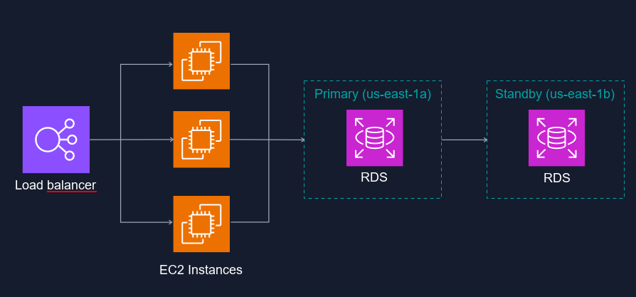

# S3 - Simple Storage Service

## What is S3
- Object storage in cloud
- Manages data as objects rather than in file systems or data blocks

### Basics
- Unlimited Storage: Total volume of data and objects is unlimited
- Objects up to 5TB in size
- Buckets instead of folders

## Working with S3
- Universal Namespace
    * All AWS accounts share same S3 namespace
    * Each S3 bucket is globally unique
- Example S3 URL: https://cs7346smu2023.s3.us-east-1.amazonaws.com/test.txt
- Server responds with HTTP 200 if upload successful

## Key-Value Store
- Key: Name of object
- Value: Data itself
- Version: store multiple versions of same object
- Metadata: content-type, last-modified, etc

## Availability and Durability
- Data is spread across multiple devices and zones
- 99.95% - 99.99% service availability
- Designed for 99.999999999% durability

## Standard S3
- Data stored in >=3 AZs
- Designed for frequent access
- Suitable for most workloads
    * Websites
    * Content distribution
    * Mobile and gaming apps

## Characteristics
- Tiered Storage
- Lifecycle Management: Can auto transition objects to cheaper storage tiers after time
- Versioning: All objects version are stored and retrievable

## Security
- Server-side encryption: Set default encryption on bucket
- Access Control List (ACLs): Define which accounts or groups are granted access
- Bucket Policies: Specify actions allowed or denied

## Storage Classes
- Frequenctly Accessed objects
    * S3 Standard
    * Reduced Redundency
- Automatically optimized: S3 Intelligent tiering
- Infrequently Accessed objects
    * S3 Standard-IA
    * S3 One Zone-IA
- Archiving Objects
    * S3 Glacier (Instant, Flexibile, or deep archive)

# S3 Object Lock
used for write once, read many (WORM)
- Prevent objects from being deleted or modified for a fixed time
- regulatory requirements if WORM is required
- Extra layer of protection

### 2 lock modes
- Governance Mode: User needs special permissions to modify
- Compliance mode: Users cannot overwrite
- Retention period for fixed time of protection
- Legal Hold: Prevent object from being overwritten

## Encryption
- Encryption in Transit: SSL, TLS, HTTPS
- Encryption at Rest (enabled by default)
    * SSE-S3: S3 managed keys using AES256
    * SSE-KMS: amazon managed keys
    * SSE-C: Customer provided keys
- Encryption at Rest
    * client side encryption
    * Encrypt before upload to S3

# Databases

## Relational Databases
- Tables, rows, columns
- AWS offerings: Aurora, MySQL, Maria, Postgre, Oracle, Microsoft sql server
- Use case: Online transaction processing (OLTP) workloads

## OLTP vs OLAP

### OLTP
- Processes data from transactions in real time
- RDS

### OLAP
- Process complex queries to analyze historical data
- Data warehoues such as redshift

## RDS
- running in minutes
- Multi AZ
- Failover capability
- Automated backups

### Multi-AZ

Multi-AZ is for disaster recovery if main DB is down, standby can be reached. Use case does not improve performance

- AWS handles replication
    * Auto syncronize writes to prod DB and standby DB
- Aurora is always multi-AZ
- Optional multi-AZ: SQL Server, MySQL, PostreSQL, Oracle, MariaDB

To improve performance, use `Read Replicas` - read-only copy of primary DB
- Take load off primary DB for read-heavy workloads
- Cross-AZ or cross-region
- Up to 5 read-replicas

## Amazon Aurora
Amazon's properietary DB
- Similar to mySQL and PostgreSQL
- Storage auto-scaling
    * Starts with 10 GB
    * Scales in 10 GB increments up to 128 TB
- Compute scales
    * Max 96 vCPUs and 768 GB memory
- 6 copies
- Self-Healing

### Types of aurora replicas
- Aurora Replicas: 15
- MySQL replicas: 5
- PostgreSQL: 5

note: Question for prof, this slide mentions `Aurora MySQL` and `Aurora PostgreSQL` - What are these?

### Aurora Backup
- Always enabled
- Can take snapshots with Aurora
    * Question: Does this mean Aurora takes a snapshot of a different RDS instance?
- Can share snapshots with other AWS accounts

### Aurora Serverless
On-demand, auto-scaling configuration for MySQL and PostgreSQL editions of Aurora.

- Auto scales
- Use case: Infrequent, intermittent, or unpredictable workloads

## Amazon DynamoDB
- NoSQL DB
- Documents and key-value
- Stored on SSD storage
- Spread across 3 AZs?
- Eventually consistent reads (default)
- Strongly consistent reads

### Eventually Consistent Reads
Consistency across all distributed copies of data is usually reached within a second
- Default option
- Best read performance

### Strongly consistent Reads
Returns a result that reflects all writes that recieved a successful response prior to the read

### DynamoDB Accelerator (DAX)

- Fully managed memory-cache
- 10x performance improvement
- Reduce request time from milliseconds to microseconds
- Dont need to manage caching on dev side
- Compatible with DynamoDB APIs

### On-Demand
- Pay-per-request pricing
- Balance cost and performance
- No min capacity
- use for new product launches

### Security
- Encryption at rest w/ KMS
- site to site VPN
- Direct Connect
- IAM policies and roles
-Fine-grained access
- CloudWatch and CloudTrail
- VPC endpoints

### DynamoDB Transactions

DynamoDB provides ACID across tables within a single AWS account and region.

**ACID**
- Atomic: All changes to data must be successful
- Consistent: Data must be in consistent state before and after transaction
- Isolated: Not other process can change data during transaction
- Durable: Changes made by transaction must persist

## DynamoDB On-Demand Backup and Restore
- Full backups
- 0 impact on performance
- Same region as source table
- Point-in-Time Recovery (PITR)
    * Restore to any point in the last 35 days
    * disabled by default

### DynamoDB Streams and Global Tables
- Time-ordered sequence of changes in a table
- Stored for 24 hours
- Multi-Master, multi-region replication
- Replication latency under 1 second

## Amazon Neptune
- Graph Database: stores node and relationships
- Use cases:
    * Connections between identities
    * Knowledge graph apps
    * Fraud detection
    * Security graphs
