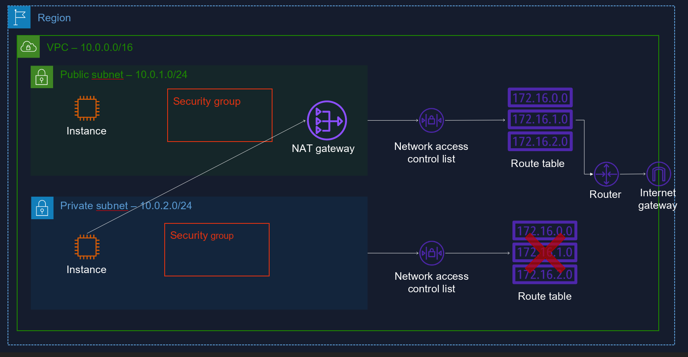
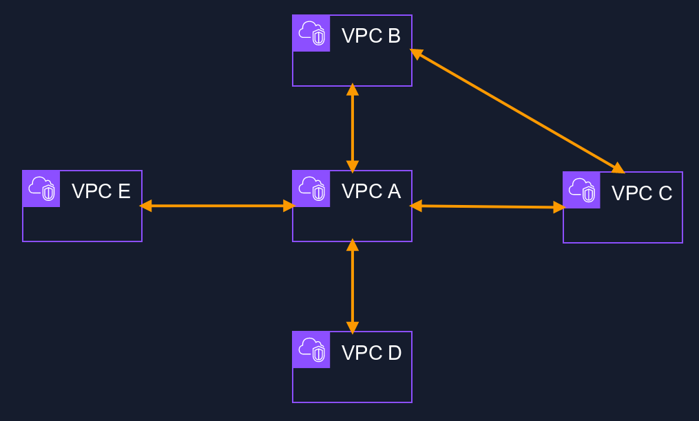

# Amazon Virtual Private Cloud (VPC)

## What is VPC
Isolated part of AWS cloud where you define own network
- Complete control of IP addr range, subnets, route tables, gateways

### Components
- Web: Public facing subnet
- Application: can run on the private subnet
- Database: Can run on private subnet

## What is Virtual Private Network (VPN)
VPN is a private connection between on-prem datacenter and VPC.
- Virtual network: no cables
- Private connection

## Using NAT Gateways for internet access
Network Address Translation (NAT) enables private subnet to connect to internet or VPC.
- Prevents internet from connecting to devices
- Redundant inside AZ
- No need to patch
- Not associated with security groups
- Automatically assigned public IP address

## Common Ports
- Linux SSH: port 22
- Windows RDP: Port 3389
- HTTP: Port 80
- HTTPS: Port 443

## Security Groups
- Virtual firewalls for you EC2 instances - last line of defense that traffic hits
- unlimited EC2 instances in each group
- Multiple security groups attached to an EC2 instance
- default: all inbound traffic is blocked, and all outbound traffic is allowed
    * To let everything in use IP address range 0.0.0.0/0
    * In production, you'd only open 0.0.0.0/0 to port 80 (HTTP) and to port 443 (HTTPS)
- **Stateful!!!**
    * if you send a request from your EC2 instance, the response traffic for that request is allowed to flow in regardless of inbound security groups rules.
    * Responses to allowed inbound traffic are allowed to flow out, regardless of outbound rules

## Network Access Control Lists (ACLs)
Optional layer of security for your VPC that acts as a firewall for controlling traffic in and out of one or more subnets.

- Used to block IP addresses
- Numbered list of rules
- Stateless response to rule
- Optional
- Enabled by default
    * Default ACL allows all inbound and outbound traffic
- Custom ACLs
    * preset custom ACL denies all inbound and outbound traffic
- Each subnet requires ACL
    * If not specifies, uses default ACL
- Multiple subnets under ACL
- 1 ACL per Subnet

## VPC Endpoints
Enables you to privately connect your VPC to supported AWS services and VPC endpoint services powered by AWS PrivateLink without requiring an internet gateway, NAT device, VPN connection, or AWS Direct Connect.
- Endpoints are virtual devices
- Traffic within AWS network

### Interface Endpoints
- Elastic network interface
- Private IP address
- entrypoint for traffic heating to AWS PrivateLink

### Gateway Endpoints
- Target specific IP routes
- Similar to NAT Gateway
- Provisioned Virtual Devices
- S3 and DynamoDB connection
- No Privatelink

## VPC Peering
- Direct connection between 2 VPCs
- Behave as-if on same network
- Can peer with other AWS accounts
- Peering is in a star configuration (e.g., 1 central VPC with 4 other VPCs) i.e., no transitive peering
- Can peer region to region

## PrivateLink
Uses a network load balancer on the service VPC and an Elastic Network Interface on the your VPCs.

- More secure security of VPC
- Like VPC peering but done at scale
- Routes traffic between VPCs and services over the AWS network
- Use case: COnnect Service VPC to your VPC

## DirectConnect
Cloud service solution to establish a dedicated private network connection between on-premise data center to AWS
- Cheaper than public network
- Faster
- More secure

### Type 1: Dedicated Connection
Physical ethernet connection associated with a single customer

### Type 2: Hosted Connection
Physical ethernet connection that an AWS Direct Connect Partner provisions on behalf of a customer
