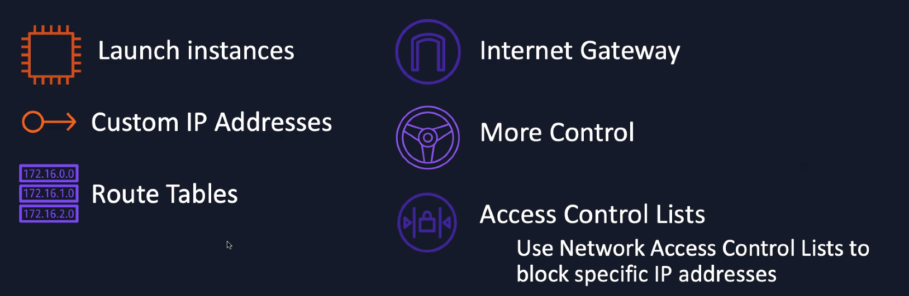
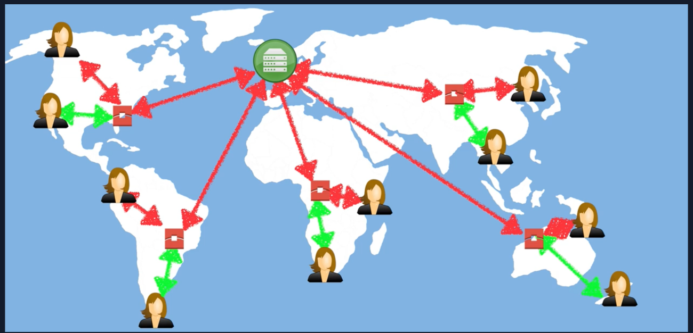
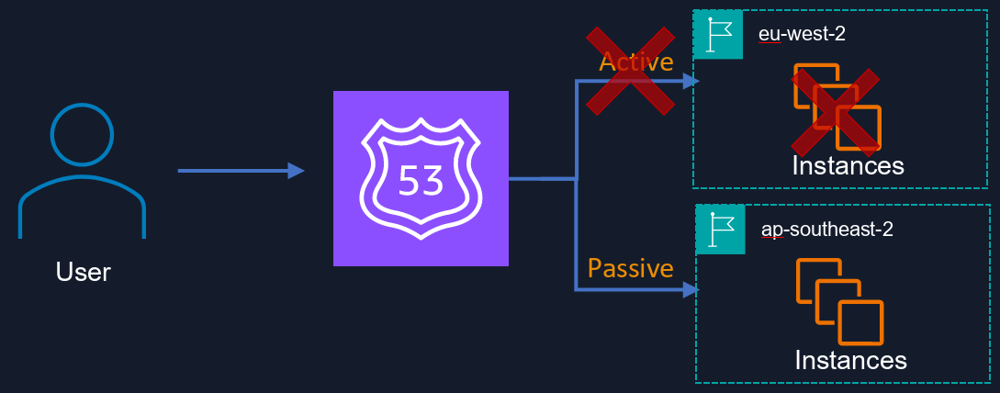

# Amazon Virtual Private Cloud (VPC)

## What is VPC
Isolated part of AWS cloud where you define own network
- Complete control of IP addr range, subnets, route tables, gateways
- See [CIDR](https://cidr.xyz/)

### Components
- Web: Public facing subnet
- Application: can run on the private subnet
- Database: Can run on private subnet

## What is Virtual Private Network (VPN)
VPN is a private connection between on-prem datacenter and VPC.
- Virtual network: no cables
- Private connection

## Using NAT Gateways for internet access
Network Address Translation (NAT) enables private subnet to connect to internet or VPC.
- Prevents internet from connecting to devices
- Redundant inside AZ
- No need to patch
- Not associated with security groups
- Automatically assigned public IP address

## Common Ports
- Linux SSH: port 22
- Windows RDP: Port 3389
- HTTP: Port 80
- HTTPS: Port 443

## Security Groups
- Virtual firewalls for you EC2 instances - last line of defense that traffic hits
- unlimited EC2 instances in each group
- Multiple security groups attached to an EC2 instance
- default: all inbound traffic is blocked, and all outbound traffic is allowed
    * To let everything in use IP address range 0.0.0.0/0
    * In production, you'd only open 0.0.0.0/0 to port 80 (HTTP) and to port 443 (HTTPS)
- **Stateful!!!**
    * if you send a request from your EC2 instance, the response traffic for that request is allowed to flow in regardless of inbound security groups rules.
    * Responses to allowed inbound traffic are allowed to flow out, regardless of outbound rules

## Network Access Control Lists (ACLs)
Optional layer of security for your VPC that acts as a firewall for controlling traffic in and out of one or more subnets.

- Used to block IP addresses
- Numbered list of rules
- Stateless response to rule
- Optional
- Enabled by default
    * Default ACL allows all inbound and outbound traffic
- Custom ACLs
    * preset custom ACL denies all inbound and outbound traffic
- Each subnet requires ACL
    * If not specifies, uses default ACL
- Multiple subnets under ACL
- 1 ACL per Subnet

## VPC Endpoints
Enables you to privately connect your VPC to supported AWS services and VPC endpoint services powered by AWS PrivateLink without requiring an internet gateway, NAT device, VPN connection, or AWS Direct Connect.
- Endpoints are virtual devices
- Traffic within AWS network

### Interface Endpoints
- Elastic network interface
- Private IP address
- entrypoint for traffic heating to AWS PrivateLink

### Gateway Endpoints
- Target specific IP routes
- Similar to NAT Gateway
- Provisioned Virtual Devices
- S3 and DynamoDB connection
- No Privatelink

## VPC Peering
- Direct connection between 2 VPCs
- Behave as-if on same network
- Can peer with other AWS accounts
- Peering is in a star configuration (e.g., 1 central VPC with 4 other VPCs) i.e., no transitive peering
- Can peer region to region

## PrivateLink
Uses a network load balancer on the service VPC and an Elastic Network Interface on the your VPCs.

- More secure security of VPC
- Like VPC peering but done at scale
- Routes traffic between VPCs and services over the AWS network
- Use case: COnnect Service VPC to your VPC

## DirectConnect
Cloud service solution to establish a dedicated private network connection between on-premise data center to AWS
- Cheaper than public network
- Faster
- More secure

### Type 1: Dedicated Connection
Physical ethernet connection associated with a single customer

### Type 2: Hosted Connection
Physical ethernet connection that an AWS Direct Connect Partner provisions on behalf of a customer

# Cloudfront

## Content Delivery Networks (CDN)
Receives the content from an origin server, then replicates it to its edge cache servers.
- Improved speed
- High scalability

### CDN Protocols
- Network Element Control Protocol (NECP)
- Web Cache Coordination Protocol (WCCP)
- SOCKS
- Cache Array Routing Protocol (CARP)
- Internet Cache Protocol (ICP)
- Hypertext Caching Protocol (HTCP)
- Cache Digest

## Key Terminology

- **Edge Location**: Edge location where content is cached. Seperate from region.
- **Origin**: Origin of the files (S3, EC2, etc)
- **Distribution**: collection of edge locations (distribution network)

## Cloudfront
Cloudfront is amazon's CDN.

## Important Settings
- Security: defaults to HTTPS
- Global Distribution: you enable in selected regions of the world
- Endpoint Support: Can be used to front AWS endpoints along with non-AWS applications (clarify with prof meaning)
- Expiring Content: Can force an expiration of content from the cache

# Route 53

## Domain Name System (DNS)
phonebook of the internet.

- convert huma-friendly domain names e.g. www.smu.edu into an Internet Protocol (IP) address e.g., http://129.119.70.166
- IPv4 and IPv6
- Internet Assigned Numbers Authority (IANA) controls domains (.edu, .com, etc)

## IPV4
- 32-bit field
- Over 4 billion different addresses (4,294,967,296 – to be precise)

## IPV6
- address space of 128 bits
- Over 340 undecillion addresses (a number equal to 1 followed by 36 zeros)

## Domain Registrars
registrar is an authority that can assign domain names under one or more top-level domains

- Organize domain names to ensure uniqueness
- Registered with InterNIC, a service of ICANN, which enforces domain name uniqueness
- Each domain becomes registered in the WHOIS database

### Popular Domain Registrars
domain.com, GoDaddy, AWS, SquareSpace, Namecheap

## Start of Authority (SoA)
Stores admin information about the domain.
- Name of the server that supplied the data for the zone
- Administrator of the zone (email address)
- Current version of the data files
- Default number of seconds for the time to live files on the resource records

## A record
Used by a computer to translate the name of the domain to an IP address
- example: https://www.smu.edu points to https://129.119.70.166

## Time to Live (TTL)
The length that a DNS record is cached on either the resolving server or the user's own local PC is equal to the value of the time to live (TTL) in seconds
- The lower the time to live, the faster the changes to DNS records take to propagate throughout the internet

## Canonical Name (CNAME)
Resolves one domain to another

## Alias Records
Mapping of CNAME to load balancers, cloudfront, etc.

## Route 53
Amazon’s DNS service
- Register domain names
- create hosted zones
- manage and create DNS records
- 8 Routing policies
    * Simple
    * weighted
    * IP-based
    * latency-based
    * failover
    * geolocation
    * geoproximity
    * multivalue answer

## Routing policies

### Simple
Route 53 returns all values to the user in a random order

### Weighted
split your traffic based on different assigned weights
- Ex: 20% of your traffic to go to us-east-1 and 80% to go to us-west-1

### Failover
Used when you want to create an active/passive setup

### Geolocation
Choose where you traffic will be sent based on the geographic location of your users

### Latency Routing
Route your traffic based on the lowest network latency for your end user (i.e., which region will give them the fastest response time).
- create a latency resource record set for the EC2 (or ELB) resource in each region that hosts your website

### Multivalue Answer Routing Policy
Like Simple Routing; however, it allows you to put health checks on each record set