# Chapter 8: Component-Based Thinking

Overview

## Definitions

### Software Component

A piece of software that performs a business function. Requirements can be applied to logical components to define their responsibilities and behaviors that developers will implement.
### logical Architecture

Structure of a system's logical components and the actors, external interfaces they interact with.
### Physical Architecture

```mermaid
flowchart TD
    Client[💻 Client/Computer] 
    
    Client --> ServiceA[Service A]
    Client --> ServiceB[Service B] 
    Client --> ServiceC[Service C]
    
    ServiceA --> DB1[(Database)]
    ServiceB --> DB1
    ServiceC --> DB1
    ServiceC --> Queue[📨 Message Queue]
    
    Queue --> ServiceD[Service D]
    ServiceD --> DB2[(Database)]
    
    ServiceA -.-> ServiceB

    style DB1 fill:#1e5091,color:#fff
    style DB2 fill:#1e5091,color:#fff
```

Structure of a system's code that implements the logic of the components.
### Component Coupling
When components communicate with each other, or when a change to one compo nent might impact other components, the components are said to be coupled together. The more coupled a system’s components are, the harder it is to maintain and test the system (see Figure 8-11). Therefore, it’s important to pay close attention to coupling.

Components coupled because they are communicating

Components coupled because a change in one impacts the other, even though they aren't communicating

### Static Coupling
Occurs when components communicate synchronously with each other. Architects need to be concerned about two types of coupling: afferent and efferent.

- **Afferent Coupling**: The degree to which other components depend on a target component.
- **Efferent Coupling**: The degree to which a target component depends on other components.
### The Law of Demeter/loose coupling
A component or service should have limited knowledge of other components or services.

## Processes

### Creating logical architecture

Logical architecture describes the structure and behavior of the system, and the external objects the system interacts with. The process to create a logical architecure is:

- Identify the core components
- Assign responsibilities to core components
- refactor based on core system requirements

### Workflow Approach
A common approach architects use for identifying the initial core components of a logical architecture is the Workflow approach. Identify the workflow a user might take through the system and allocate components to each action.

### Actor/Action Approach

Another way architects identify initial core components is the Actor/Action approach. This approach is particularly useful when a system has multiple actors.
- Identify the major business logic performed
- Identify the actors and systems
- Identify the actions each actor and system can take
- Allocate the actions to the business logic

