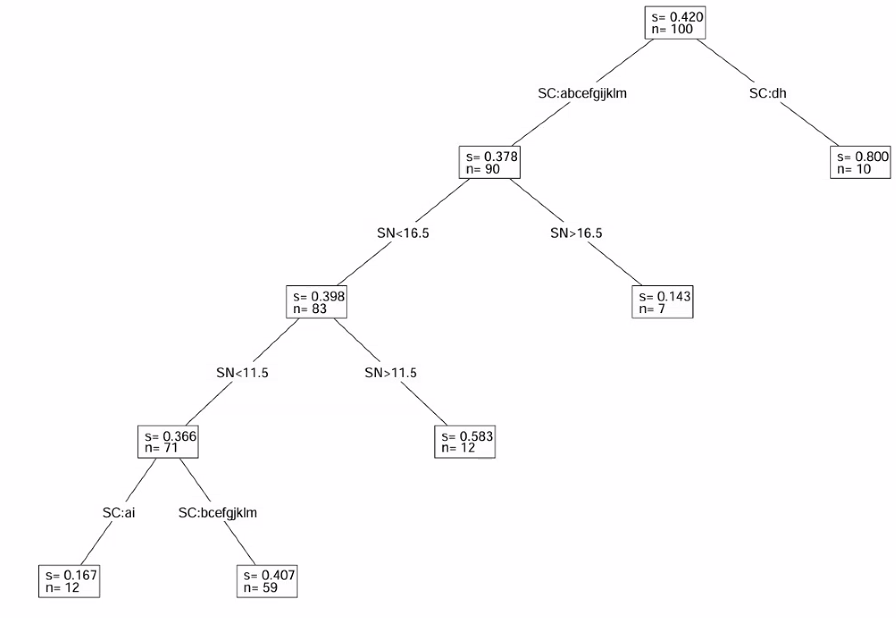
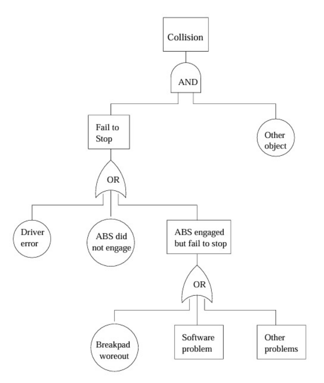
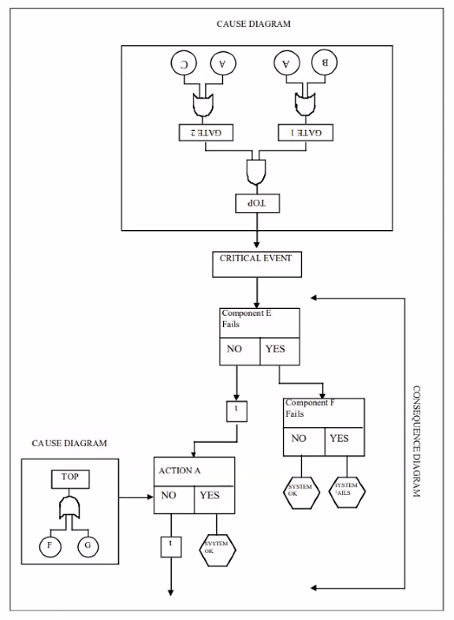

# Software Reliability Growth Models (SRGMs)

Show defects over time (Very important metric).

# Tree Based Reliability Models (TBRM)

Use a binary tree to partition the run logs and quickly search for high defect rate within the logs.
- Also used to partition domain on multiple variables: ex: defect rate where run > 100 AND memory < 1024 gb

## TBRM Result Comparison

Methdology to use laplace to partition the domain and compare defect growth.

ρ= (𝜆_0 − 𝜆_𝑇)/(𝜆_0)=1 − (𝜆_𝑇)/(𝜆_0)
𝜆_0: failure rate at start of testing
𝜆_𝑇: failure rate at end of testing

EX: 

| Purificaiton (ρ) | A | B | C | D |
| ---------------- | - | - | - | - |
| Max | 0.715 | 0.527 | 0.542 | 0.990 |
| Median | 0.653 | 0.525 | 0.447 | 0.940 |
| Min | 0.578 | 0.520 | 0.351 | 0.939 |

## Validation goals
- Trend of reliability growth
- Stability of failure arrivals
- Estimated reliability
- Product purity level at exit

## Process changes and improvements
- Failure detection and fault removal
- Long term effect on development

## Integrated Approach method

- **Prep work**
    * Test Case and Execution
- **Data Capturing Tools**
    * Test Logs (Input state, execution, result)
    * Detailed Logs (detailed execution info)
    * Defect Logs
- **Analysis Tools**
    * SMERFS (Reliability Growth Model)
    * Regression analysis
    * Reliability growth model
    * tree-based test data analysis
    * tree-based design/code analysis
- **Presentation Tools**
    * Tree browser (Tree exploration)
    * Data Visualization
    * Result Presentation
    * Tree Exploration
- **Follow-up**
    * Exploration Results
    * Data visualization and analysis

# Hazards Analysis

- List failure scenarios (actual/hypothetical)
- Perform a hazard anaysis and assessment
    * Fault Tree (logical conditions)
    * Event Tree (Dynamic sequences)
- Disastor mitigation/recovery
    * Hazard elimination, reduction, control

## Scopes

- **Sub-system hazard analysis (SSHA)**
    - Hazard within individual sub-system 
    - Component/sub-system in isolation 
- **System hazard analyses (SHA)**
    - Focus: interface and interaction 
    - Sub system/environment/human effect on system 

## Techniques

- Fault-tree analyses (FTA) 
- Event-tree analyses (ETA) 
- Design reviews & checklists 
- Hazard indices 
- Risk trees 
- Cause-consequence analysis (CCA) 
- Hazard & operability analysis (HAZOP) 
- Failure modes and effect analysis (FMEA) 
- FMECA (FMEA + Criticality), etc. 
- System Theoretic Accident Mode (STAMP) (Model 4)

### Techniques: Fault Tree Analysis (FTA)

All the events after a failure

Example fault tree analysis of a vehicle. Usually manually constructed by engineer.

Construct code base as a statemachine to trace system events and states into a graph. 

Also referred to as software fault tree analysis (SFTA)

### Techniques: Event Tree Analysis (ETA)

All the events before a failure

### Techniques: Cause Consequence Analysis

Combined view of ETA and FTA to identify the cause of failure.

